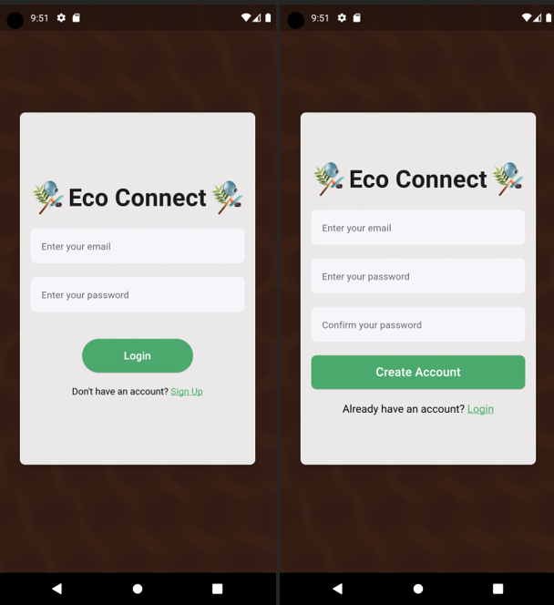
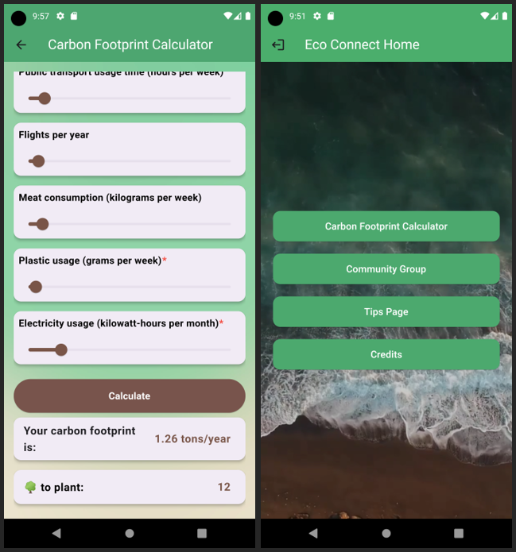
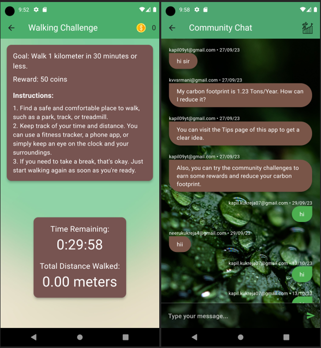
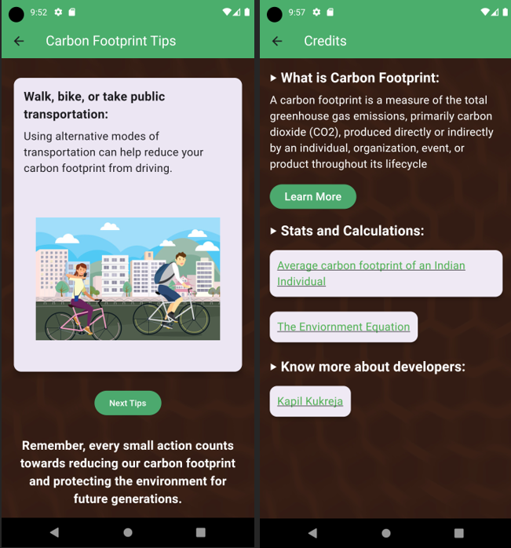

# Eco Connect - Comprehensive Sustainability Platform

Welcome to Eco Connect, your one-stop destination for embracing a sustainable lifestyle and making a positive impact on the environment. This dynamic mobile application, built using Flutter and Firebase, is designed to empower users like you to lead eco-conscious lives by offering a wide range of features and utilities. Whether you're looking to reduce your carbon footprint, discover sustainable products and services, connect with a community of like-minded individuals, or contribute to environmental causes, Eco Connect has got you covered.

## Table of Contents
- [Introduction](#introduction)
- [Key Features](#key-features)
- [Contributing](#contributing)

## Introduction

The core aspiration of the "Eco Connect" initiative is to craft a dynamic mobile application functioning as a holistic sustainability hub for its users. The application, built with Flutter and powered by Firebase, will serve as a conduit for encouraging sustainable lifestyle choices by encompassing an array of features and utilities. Users will be equipped to compute and monitor their carbon footprint effectively, gain access to insights regarding sustainable goods and services, and foster connections with a community of individuals who share their environmentally conscious mindset. Through these capabilities, the application will enable users to actively adopt eco-friendly decisions, thereby catalyzing positive contributions towards a greener world.

## Key Features

### 1. Carbon Footprint Assessment Tool
   - Calculate and monitor your carbon footprint to track your environmental impact.

### 2. Sustainable Product Locator
   - Find sustainable products near you, helping you make eco-friendly choices in your daily life.

### 3. Eco-Conscious Services Directory
   - Discover a comprehensive list of services that prioritize environmental sustainability.

### 4. Vibrant Social Community
   - Connect with a community of individuals who share your commitment to sustainability.

### 5. Sustainability Goal Setting
   - Set and celebrate your sustainability goals, motivating yourself and inspiring others.

### 6. Informative Learning Materials
   - Access a repository of informative materials to enhance your knowledge about sustainability.

### 7. Donations and Fundraising
   - Contribute to environmental causes by making donations and participating in fundraising efforts.

### 8. Comprehensive Impact Evaluation
   - Monitor the positive impact of your sustainable choices and contributions to environmental causes.

### 9. Strategic Partnerships
   - Benefit from partnerships with eco-sensitive brands and influential personalities committed to sustainability.

## Screenshots

## Contributing

We welcome contributions from the community to make Eco Connect even better
